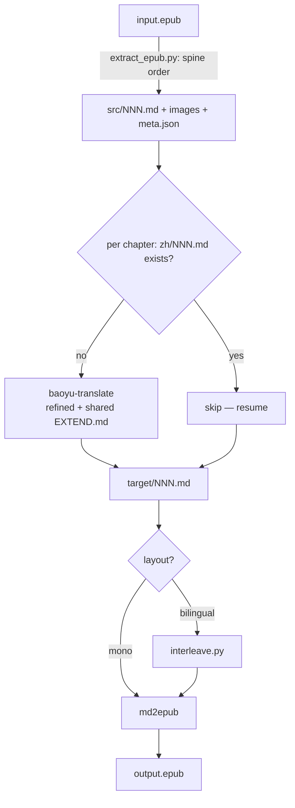

# epub-translate

A Claude Code skill that translates an EPUB ebook into another language and repackages it as a new EPUB.

> **中文说明**: [README.zh-CN.md](README.zh-CN.md)

## Features

- Unzips the book and recovers chapters in **spine (reading) order** — not arbitrary filename order
- Delegates per-chapter translation to the **baoyu-translate** skill, sharing a glossary (`EXTEND.md`) so names and jargon stay consistent across the whole book
- Delegates EPUB packaging to the [md2epub](../md2epub/) skill (TOC, Mermaid, etc.)
- Two output layouts: `mono` (translation only) and `bilingual` (original + translation per paragraph)
- **Chapter-level resume** — interrupted runs pick up where they left off

## Requirements

| Dependency | Install | Required |
|------------|---------|----------|
| baoyu-translate skill | install the baoyu skills plugin | Yes |
| [md2epub skill](../md2epub/) | `cp -r md2epub ~/.claude/skills/md2epub` | Yes |
| [pandoc](https://pandoc.org) | `brew install pandoc` | Yes |
| python3 | pre-installed on macOS | Yes |
| Node.js / npx | [nodejs.org](https://nodejs.org) | Only if chapters contain Mermaid |

## Installation

```bash
# 1. Install this skill
cp -r epub-translate ~/.claude/skills/epub-translate

# 2. Install md2epub skill (required dependency)
cp -r md2epub ~/.claude/skills/md2epub

# 3. Install the baoyu skills plugin (provides baoyu-translate)
```

## Usage

Invoke with natural language; Claude triggers the skill on relevant intent.

**English triggers:**
- "translate this epub to chinese"
- "make a bilingual epub from book.epub"

**中文唤醒:**
- "把这本 epub 翻译成中文"
- "epub 翻译成中英对照"

### Parameters

| Parameter | Description | Default |
|-----------|-------------|---------|
| `input_epub` | Source `.epub` path | *(required)* |
| `output_epub` | Output path | `{stem}.{target_lang}.epub` |
| `target_lang` | Target language | `zh-CN` |
| `layout` | `mono` / `bilingual` | `mono` |
| `mode` | `quick` / `normal` / `refined` (baoyu-translate) | `refined` |

### Examples

**To Chinese, translation only:**
> "把 ~/Books/clean-code.epub 翻译成中文"

**Bilingual study edition:**
> "translate ./pragmatic.epub into a bilingual English-Chinese book"

**Test first two chapters:**
> "先翻 book.epub 前两章试试转中文"

## How it works



## File structure

```
epub-translate/
├── SKILL.md                  # Skill definition (read by Claude Code)
├── README.md                 # This file
├── README.zh-CN.md           # Chinese documentation
└── scripts/
    ├── extract_epub.py       # EPUB → ordered Markdown + images (spine order)
    └── interleave.py         # source + translation → bilingual chapter
```

## Notes & limitations

- **Cost**: A full book is many chapters; `refined` mode is slow and token-heavy. Test on 1–2 chapters first.
- **Bilingual alignment**: interleaving pairs paragraphs by block count. When the translator merges/splits paragraphs, that chapter falls back to a clean whole-chapter layout (translation intact, original appended) and is listed in the report.
- **Format fidelity**: pandoc loses complex layout (nested tables, some footnotes). Fine for prose and technical books; not for heavily-designed titles.
- **DRM**: DRM-protected EPUBs cannot be extracted.

## Troubleshooting

| Problem | Fix |
|---------|-----|
| "baoyu-translate not found" | Install the baoyu skills plugin |
| "no chapters extracted" | Not a valid EPUB, or DRM-protected |
| Inconsistent term translations | Ensure chapters run sequentially so `EXTEND.md` accumulates |
| Bilingual chapter looks off | Check the fallback list in the report; that chapter had a paragraph mismatch |
| md2epub errors | Check pandoc: `brew install pandoc` |

## Version

Current version: **1.0.0**

Changes:
- `1.0.0` — Initial release: spine-ordered extraction + baoyu-translate delegation + md2epub packaging, mono/bilingual layouts, chapter-level resume
