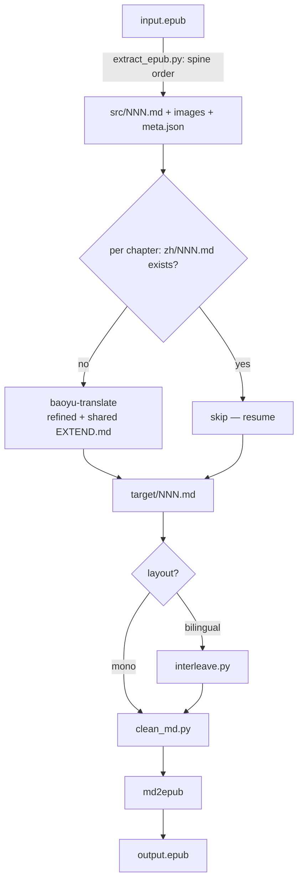

# epub-translate

A Claude Code skill that translates an EPUB ebook into another language and repackages it as a new EPUB.

> **中文说明**: [README.zh-CN.md](README.zh-CN.md)

## Features

- Unzips the book and recovers chapters in **spine (reading) order** — not arbitrary filename order
- Delegates per-chapter translation to the **baoyu-translate** skill, sharing a glossary (`EXTEND.md`) so names and jargon stay consistent across the whole book
- Delegates EPUB packaging to the [md2epub](../md2epub/) skill (TOC, Mermaid, etc.)
- Two output layouts: `mono` (translation only) and `bilingual` (original + translation per paragraph)
- **Chapter-level resume** — interrupted runs pick up where they left off

## Requirements

| Dependency | Install | Required |
|------------|---------|----------|
| baoyu-translate skill | install the baoyu skills plugin | Yes |
| [md2epub skill](../md2epub/) | `cp -r md2epub ~/.claude/skills/md2epub` | Yes |
| [pandoc](https://pandoc.org) | `brew install pandoc` | Yes |
| python3 | pre-installed on macOS | Yes |
| Node.js / npx | [nodejs.org](https://nodejs.org) | Only if chapters contain Mermaid |

## Installation

```bash
# 1. Install this skill
cp -r epub-translate ~/.claude/skills/epub-translate

# 2. Install md2epub skill (required dependency)
cp -r md2epub ~/.claude/skills/md2epub

# 3. Install the baoyu skills plugin (provides baoyu-translate)
```

## Usage

Invoke with natural language; Claude triggers the skill on relevant intent.

**English triggers:**
- "translate this epub to chinese"
- "make a bilingual epub from book.epub"

**中文唤醒:**
- "把这本 epub 翻译成中文"
- "epub 翻译成中英对照"

### Parameters

| Parameter | Description | Default |
|-----------|-------------|---------|
| `input_epub` | Source `.epub` path | *(required)* |
| `output_epub` | Output path | `{stem}.{target_lang}.epub` |
| `target_lang` | Target language | `zh-CN` |
| `layout` | `mono` / `bilingual` | `mono` |
| `mode` | `quick` / `normal` / `refined` (baoyu-translate) | `refined` |

### Examples

**To Chinese, translation only:**
> "把 ~/Books/clean-code.epub 翻译成中文"

**Bilingual study edition:**
> "translate ./pragmatic.epub into a bilingual English-Chinese book"

**Test first two chapters:**
> "先翻 book.epub 前两章试试转中文"

## How it works



## File structure

```
epub-translate/
├── SKILL.md                  # Skill definition (read by Claude Code)
├── README.md                 # This file
├── README.zh-CN.md           # Chinese documentation
└── scripts/
    ├── extract_epub.py       # EPUB → ordered Markdown + images (spine order)
    ├── interleave.py         # source + translation → bilingual chapter
    └── clean_md.py           # flatten dead links + strip {#id} attrs before packaging
```

## Notes & limitations

- **Cost**: A full book is many chapters; `refined` mode is slow and token-heavy. Test on 1–2 chapters first.
- **Bilingual alignment**: interleaving aligns the two chapters with difflib, anchoring on structural blocks (headings, code, figures), so every chapter is interleaved paragraph-by-paragraph. Fenced code blocks stay atomic and figures are de-duplicated. Where the translator merged/split paragraphs, those few blocks are grouped (source run then translation run) and the chapter is listed in the report.
- **Format fidelity**: pandoc loses complex layout (nested tables, some footnotes). Fine for prose and technical books; not for heavily-designed titles.
- **DRM**: DRM-protected EPUBs cannot be extracted.

## Troubleshooting

| Problem | Fix |
|---------|-----|
| "baoyu-translate not found" | Install the baoyu skills plugin |
| "no chapters extracted" | Not a valid EPUB, or DRM-protected |
| Inconsistent term translations | Ensure chapters run sequentially so `EXTEND.md` accumulates |
| Bilingual chapter looks off | Check the grouped-paragraph list in the report; the translator merged/split text there |
| md2epub errors | Check pandoc: `brew install pandoc` |

## Version

Current version: **1.3.4**

Changes:
- `1.3.4` — More `clean_md.py` link cases from a TOC-heavy Packt title: empty-text anchors (`[](toc.xhtml#x)`, common in exported contents pages) are now flattened too, and an `` whose src is not a real image — e.g. a mangled `` produced when an empty link follows a `!` — is dropped to its alt text rather than emitted as a broken image (RSC-007). Real images (image-extension/`http(s)`/`data:` src) are untouched. (One remaining gotcha is not auto-fixed: a heading whose entire content is an image, e.g. `# `, breaks the generated nav — give it a text title.)
- `1.3.3` — `clean_md.py` link flattening hardened on a real, heavily cross-referenced title. It now (1) handles link text containing escaped brackets (e.g. `[As a \[role\], I want …](…)`), (2) flattens `http(s)` URLs with a malformed host that EPUB extraction sometimes emits (e.g. `https://wiki.solidbook.iohref=…`, which epubcheck rejects as RSC-020), and (3) treats *every* non-`http(s)`/`mailto` link as dead — any relative path, `#anchor`, or notion-style slug — since none resolve after repackaging (RSC-007). Real http(s)/mailto links and images are still kept.
- `1.3.2` — Nested table-of-contents pages. A TOC with its own indented sub-numbering can't be merged per entry without flattening, so it now emits the whole source tree, a divider, then the whole translated tree — a non-list block between them makes Pandoc number each tree independently (no doubling), and the nesting is preserved. Flat TOCs still merge per entry. Without this, the per-block interleave emitted the whole English list then the whole Chinese list and Pandoc numbered them 1..N then N+1..2N.
- `1.3.1` — Fixed merged-TOC indentation for two-digit list numbers. Continuation lines (translated title, descriptions) are now indented to the marker width instead of a fixed 4 spaces, so entries numbered 10+ no longer fell out of the list item and rendered as indented code (literal `**`, monospace).
- `1.3.0` — `interleave.py` now detects table-of-contents pages (a page that is essentially one big top-level ordered list) and merges each entry with its translation into a single numbered list item. Without this, the per-block interleave emitted the source item then the translated item, and Pandoc renumbered the doubled list sequentially, so chapter numbering ran together (1,2,3,4 for two entries). Prose chapters that merely contain a short list are unaffected (detection requires ≥8 numbered items and ~all body lines inside the list). Verified on a real No Starch math title whose brief/detailed contents pages were doubling.
- `1.2.0` — New `clean_md.py` packaging pass (Step 4b) flattens dead cross-reference links (`chNN.html`, `#anchor`) and strips Pandoc `{#id .class}` attribute blocks, eliminating the RSC-007/012 (missing resource / bad fragment) and RSC-005 (duplicate-ID, from bilingual-interleaved table captions) errors that epubcheck otherwise reports. It skips fenced code so code text and fence info strings are untouched, and is idempotent. Mono layout now assembles into a fresh `mono/` dir instead of packaging straight from the resume cache. Verified end-to-end with epubcheck (0 errors) on a real O'Reilly title with cross-references and id-tagged appendix tables.
- `1.1.0` — Robust bilingual interleave + image paths. `interleave.py` now keeps fenced code blocks atomic (the old blank-line split tore fences that contained internal blank lines, which silently swallowed every following figure), aligns chapters with difflib so paragraph merge/split degrades locally instead of falling back to a whole-chapter layout, and de-duplicates figures. `extract_epub.py` now flattens image references to bare basenames so they resolve against the flat `images/` store (previously `assets/…`-style prefixes broke every figure at packaging time). Verified end-to-end with epubcheck (0 errors, 107 figures) on a real code- and figure-heavy O'Reilly title.
- `1.0.0` — Initial release: spine-ordered extraction (strips Pandoc styling wrappers — fenced/native divs, heading attributes, and inline-code/link attributes — so Tailwind-style classes don't leak as literal text) + baoyu-translate delegation + md2epub packaging, mono/bilingual layouts, chapter-level resume. Verified end-to-end with epubcheck (0 errors) on a real 46-chapter EPUB, including a real baoyu-translate run on a code-heavy chapter.
