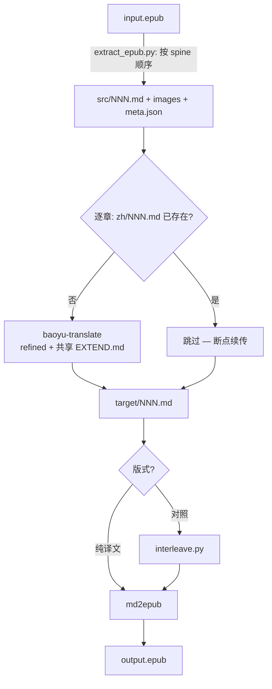

# epub-translate

把一本 EPUB 电子书翻译成另一种语言，并重新打包成新的 EPUB 的 Claude Code skill。

> **English**: [README.md](README.md)

## 特性

- 解包后按 **spine（阅读）顺序**还原章节——而不是靠文件名排序（EPUB 内部文件名常常是乱的）
- 逐章委托 **baoyu-translate** skill 翻译，全书共享术语表（`EXTEND.md`），保证人名、专有名词、黑话译名一致
- 打包委托 [md2epub](../md2epub/) skill（目录、Mermaid 等）
- 两种输出版式：`mono`（纯译文）和 `bilingual`（逐段原文 + 译文对照）
- **章节级断点续传**——中途中断后重跑会接着翻

## 依赖

| 依赖 | 安装 | 必需 |
|------|------|------|
| baoyu-translate skill | 安装 baoyu skills 插件 | 是 |
| [md2epub skill](../md2epub/) | `cp -r md2epub ~/.claude/skills/md2epub` | 是 |
| [pandoc](https://pandoc.org) | `brew install pandoc` | 是 |
| python3 | macOS 自带 | 是 |
| Node.js / npx | [nodejs.org](https://nodejs.org) | 仅当章节含 Mermaid |

## 安装

```bash
# 1. 安装本 skill
cp -r epub-translate ~/.claude/skills/epub-translate

# 2. 安装 md2epub skill（必需依赖）
cp -r md2epub ~/.claude/skills/md2epub

# 3. 安装 baoyu skills 插件（提供 baoyu-translate）
```

## 用法

用自然语言唤起，Claude 检测到意图后自动触发。

**中文唤醒:**
- "把这本 epub 翻译成中文"
- "epub 翻译成中英对照"

**English triggers:**
- "translate this epub to chinese"
- "make a bilingual epub from book.epub"

### 参数

| 参数 | 说明 | 默认 |
|------|------|------|
| `input_epub` | 源 `.epub` 路径 | *(必填)* |
| `output_epub` | 输出路径 | `{文件名}.{目标语言}.epub` |
| `target_lang` | 目标语言 | `zh-CN` |
| `layout` | `mono`（纯译文）/ `bilingual`（对照） | `mono` |
| `mode` | `quick` / `normal` / `refined`（透传给 baoyu-translate） | `refined` |

### 示例

**翻译成中文、纯译文:**
> "把 ~/Books/clean-code.epub 翻译成中文"

**中英对照学习版:**
> "把 ./pragmatic.epub 翻成中英对照的电子书"

**先试前两章:**
> "先翻 book.epub 前两章试试转中文"

## 工作原理



## 文件结构

```
epub-translate/
├── SKILL.md                  # skill 定义（Claude Code 读取）
├── README.md                 # 英文文档
├── README.zh-CN.md           # 本文件
└── scripts/
    ├── extract_epub.py       # EPUB → 有序 Markdown + 图片（按 spine 顺序）
    └── interleave.py         # 原文 + 译文 → 对照章节
```

## 注意事项与限制

- **成本**：整本书章节多，`refined` 模式慢且耗 token。建议先拿 1-2 章试通。
- **对照对齐**：interleave 用 difflib 对齐原文/译文，以结构块（标题、代码、图片）为锚点，每章都做到逐段对照。代码块保持原子完整，图片自动去重。译者合并/拆分段落的少数地方会成组输出（原文整段接译文整段），并在报告里列出该章。
- **格式损耗**：pandoc 会丢复杂排版（嵌套表格、部分脚注）。散文和技术书够用，重排版画册类不适合。
- **DRM**：带 DRM 的 EPUB 无法解包。

## 常见问题

| 问题 | 解决 |
|------|------|
| "baoyu-translate not found" | 安装 baoyu skills 插件 |
| "no chapters extracted" | 不是合法 EPUB，或带 DRM |
| 译名前后不一致 | 确保章节按顺序翻译，让 `EXTEND.md` 逐步累积 |
| 对照章节排版异常 | 看报告里的成组段落清单，该章译者合并/拆分了段落 |
| md2epub 报错 | 检查 pandoc：`brew install pandoc` |

## 版本

当前版本：**1.1.0**

变更：
- `1.1.0` — 健壮的双语对照与图片路径。`interleave.py` 现在把 fenced 代码块作为原子整体处理（旧版按空行切块会切断含内部空行的代码块、fence 错乱并悄悄吞掉其后所有插图），用 difflib 对齐章节，使段落合并/拆分只在局部成组降级、不再整章回退，并对图片去重。`extract_epub.py` 现在把图片引用重写为纯 basename，与平铺的 `images/` 存储匹配（旧版保留 `assets/…` 之类前缀，打包时会让每张图失效）。已在一本代码与插图都密集的 O'Reilly 真书上端到端验证（epubcheck 零错误、107 张插图）。
- `1.0.0` — 首次发布：按 spine 顺序解包（剥离 Pandoc 样式 wrapper——fenced/native div、标题属性、行内代码/链接属性——避免 Tailwind 类名以字面文本泄漏）+ 委托 baoyu-translate 翻译 + 委托 md2epub 打包，支持纯译文/对照两种版式，章节级断点续传。已在真实 46 章 EPUB 上端到端验证（epubcheck 零错误），含对代码密集章节真跑 baoyu-translate。
